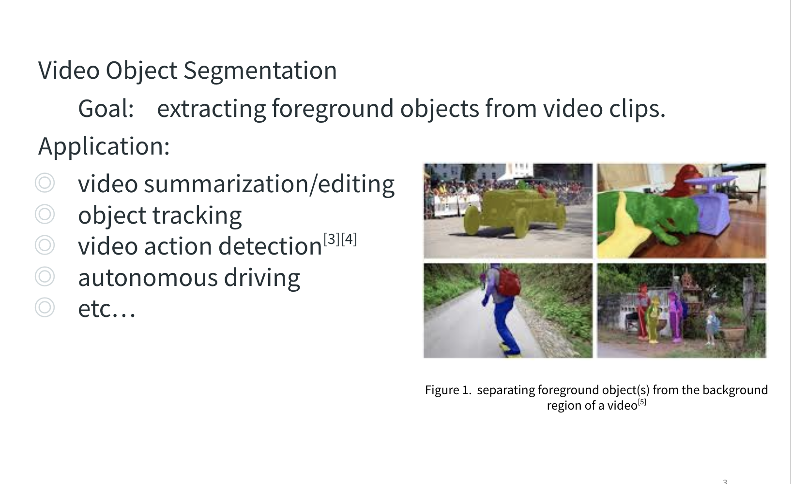
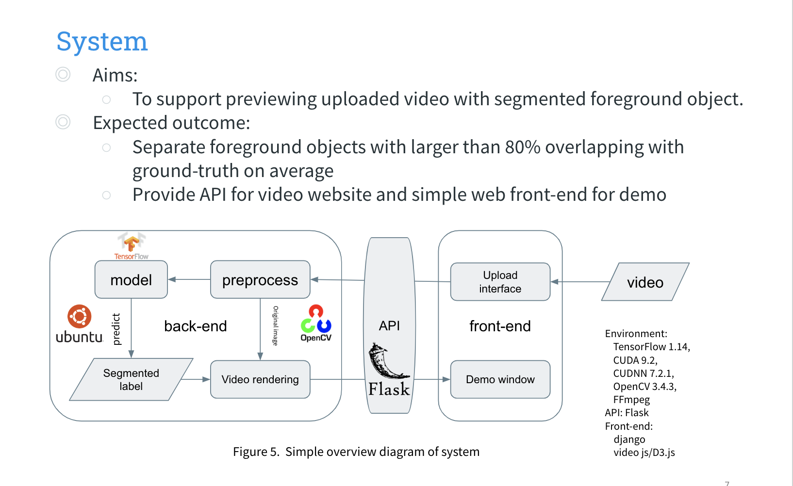

# Video-Object-Segmentation-STCNN

Final project for EECS E6893 Big Data Analytics @ Columbia.


## Introduction

In this project, we used One-Shot Video Object Segmentation method to 
extract foreground object and provide front-end visualization. 



### Back-End Model
OSVOS is a method that tackles the task of semi-supervised video object 
segmentation. It is based on a fully-convolutional neural network 
architecture that is able to successively transfer generic semantic 
information, learned on ImageNet, to the task of foreground segmentation, 
and finally to learning the appearance of a single annotated object  of 
the test sequence. 

### Front-End 
 
We also provide a web app to visualize the result.
Using django to build a web interface. 
User can upload the original video on the web interface. 
When the video is uploaded, django sends request post to flask api. 
Then the flask api gets the video file, do data preprocess, 
use model to predict the segmentation label in the video(track object), 
rendering the video and return it back to the django. 
Finally, user can watch the rendered video on web interface. 


## Code


### Structure

```
.
├── data_utils
│   ├── dataset.py # contrust data pipeline
│   └── video_utils.py # process videos
├── DAVIS # data
├── demo_tools # demo result
│   └── osvos_demo.py
├── frontend # front-end code
│   ├── app
│   ├── frontend
│   ├── upload
│   ├── manage.py
│   └── README.md
├── osvos_net # network structure
│   └── net.py
├── tmp # tmp result
├── app.py # back-end code
├── LICENSE
└── README.md

```

### Back-End

- The back-end api is provided by Flask. It would accept requests from
front-end, process data and use model to predict. A simple cache is also
provide to avoid redundant query.
- Code related to model is inside `data_utils`, `osvos_net` 
and `demo_tools`. You can also refer to 
[code](https://github.com/scaelles/OSVOS-TensorFlow) provided by original
paper.

- Deployment
    ```bash
    python3 manage.py runserver
    ```
    
- Temporary result will be stored in `tmp`.
- Model weights will be stored in `models`. Notice that code related to
training is split from demo part. 
See comments inside `osvos_net` for details.

### Front-End

- Use django to build a web interface. See [README.md](frontend/README.md)
for details.

- Deployment
    ```bash
    python3 app.py
    ```

## Citation

OSVOS: One-Shot Video Object Segmentation

[code](https://github.com/scaelles/OSVOS-TensorFlow)

```
@Inproceedings{Cae+17,
  Title          = {One-Shot Video Object Segmentation},
  Author         = {S. Caelles and K.K. Maninis and J. Pont-Tuset and L. Leal-Taix\'e and D. Cremers and L. {Van Gool}},
  Booktitle      = {Computer Vision and Pattern Recognition (CVPR)},
  Year           = {2017}
}
```

DAVIS-2016 Dataset
```
@inproceedings{Perazzi_CVPR_2016,
  author    = {Federico Perazzi and
               Jordi Pont-Tuset and
               Brian McWilliams and
               Luc Van Gool and
               Markus Gross and
               Alexander Sorkine-Hornung},
  title     = {A Benchmark Dataset and Evaluation Methodology for Video Object Segmentation},
  booktitle = {The IEEE Conference on Computer Vision and Pattern Recognition (CVPR)},
  year      = {2016}
}
```

## Presentation

- [Proposal Link](https://docs.google.com/presentation/d/1f9xcCtQVfof7RlOE3WfDpcNH4mab9r5rl-oIq-pGics/edit?usp=sharing)
- [Final Slides Link](https://docs.google.com/presentation/d/1f9xcCtQVfof7RlOE3WfDpcNH4mab9r5rl-oIq-pGics/edit?usp=sharing)

## Contact

- [Chong Hu](ch3467@columbia.edu), UNI ch3467
- [Yanlin Liu](yl4238@columbia.edu), UNI yl4238